# BrewMatic - Automated Brewing System

[](https://paypal.me/FedericoBolelli)

<p align="center">
  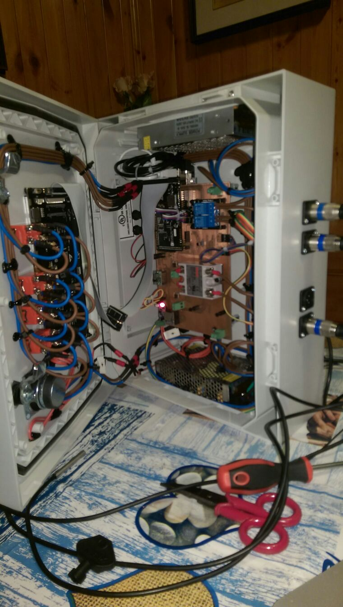
  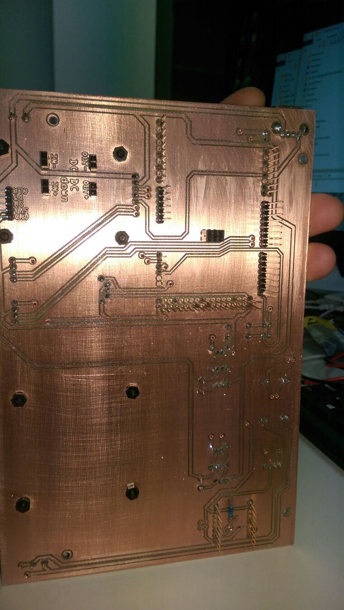
  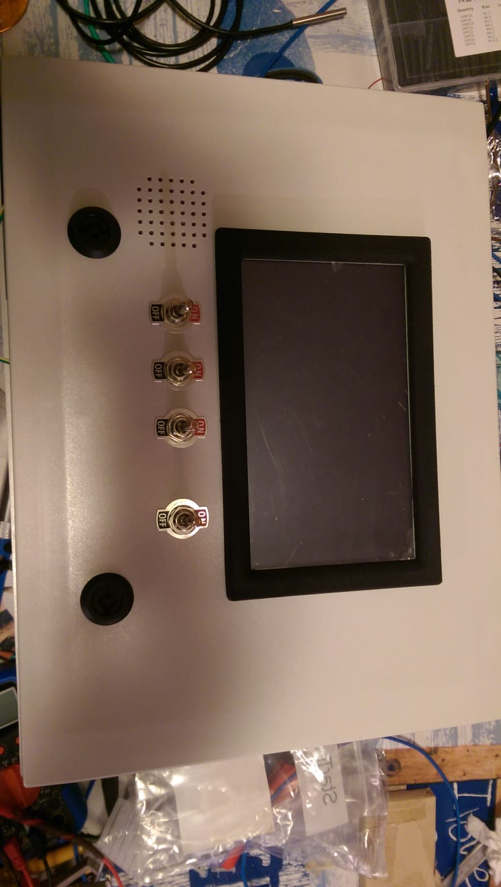
  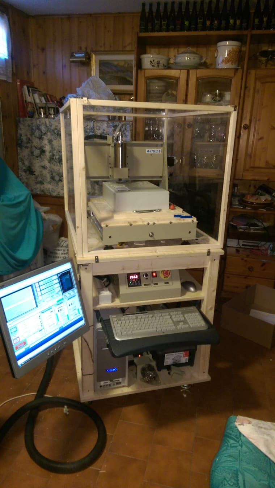
  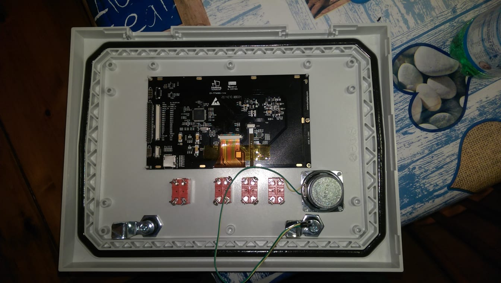
  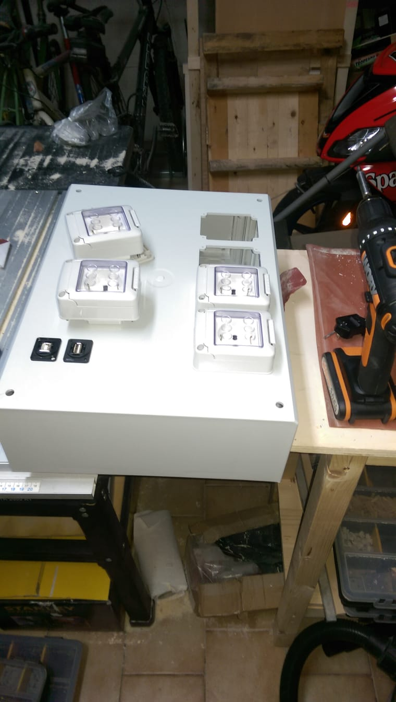
</p>

<p align="center">
  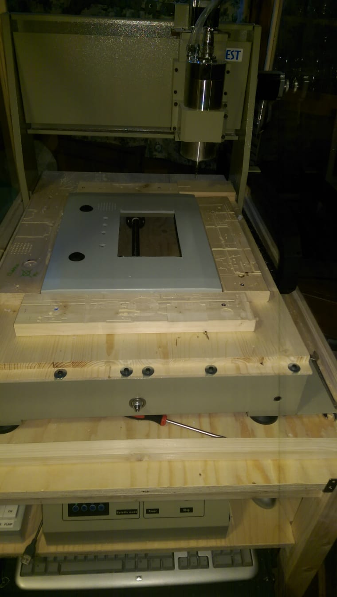
  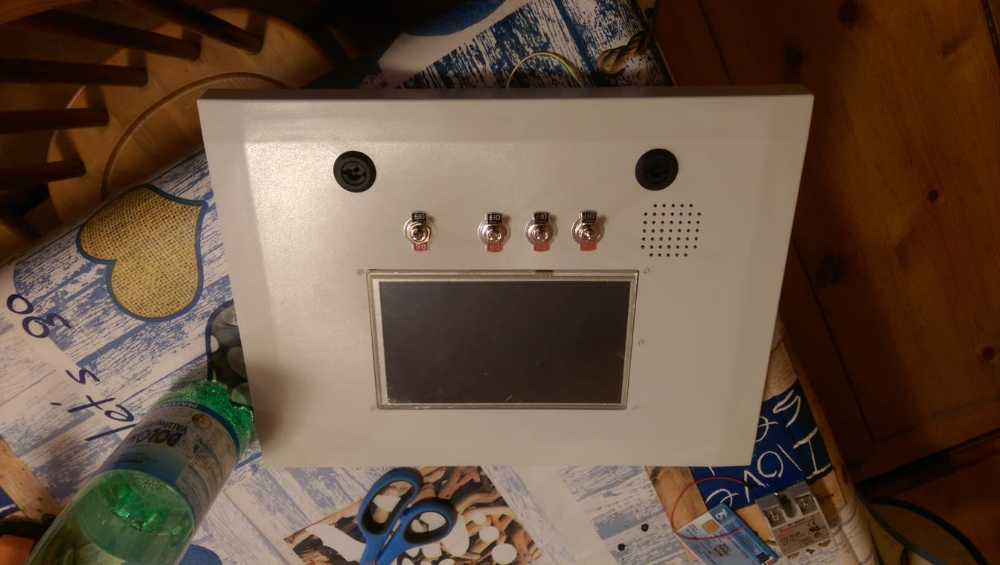
  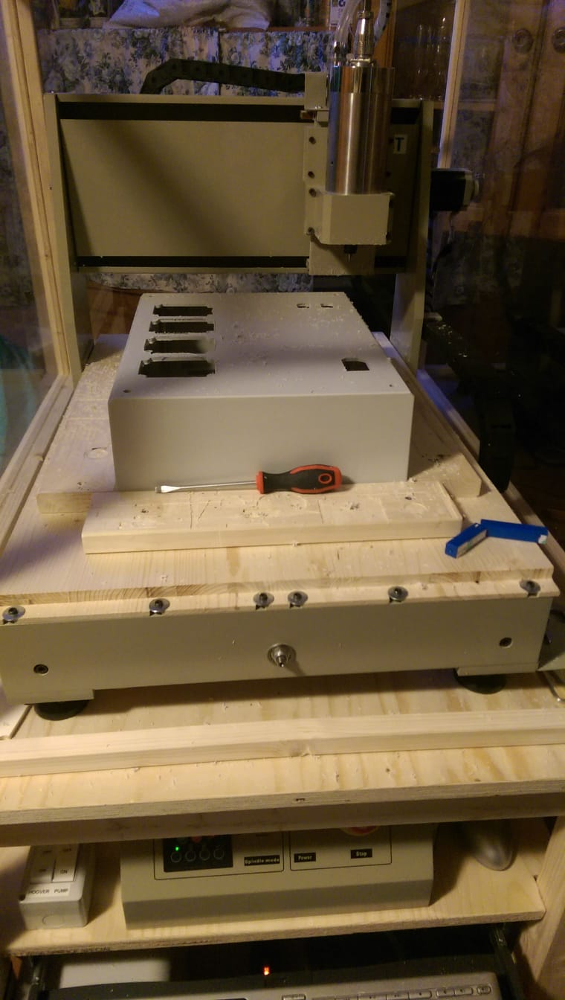
  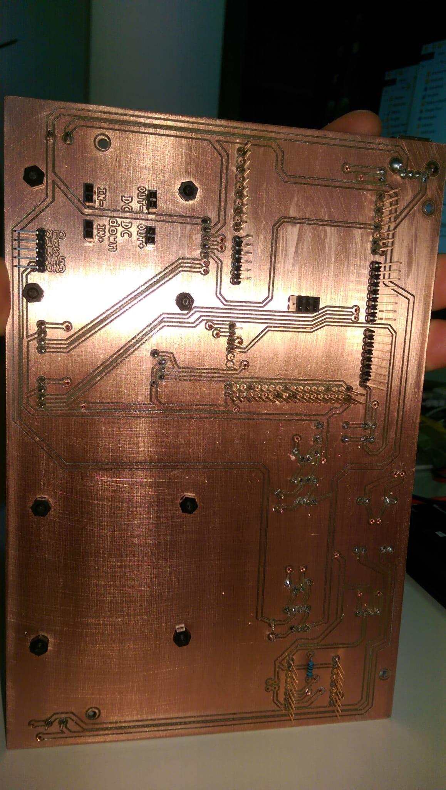
  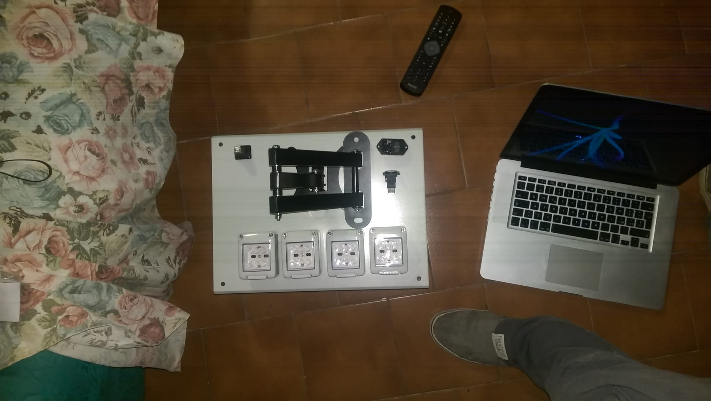
  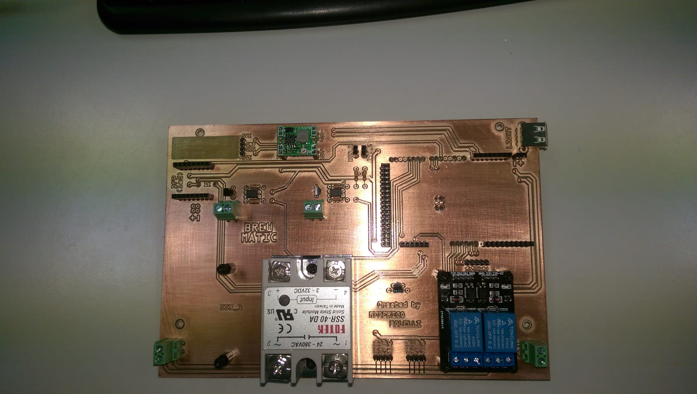
</p>

An Arduino-based automated brewing control system with touch screen interface for managing mash, sparge, and boil processes.

## Overview

BrewMatic is a comprehensive brewing automation system built on Arduino Mega 2560 with a large TFT touch display (800x480). The system provides automated temperature control, step management, and real-time monitoring for the entire brewing process.

### Key Features

- **Multi-stage Process Control**: Automated management of Mash, Sparge, and Boil phases
- **Temperature Monitoring**: Multiple DS18B20 sensors for precise temperature control
- **Touch Screen Interface**: Intuitive GUI with tabs, buttons, and real-time data visualization
- **Recipe Management**: Configurable brewing recipes with multiple mash steps
- **Safety Features**: Temperature delta monitoring, sensor error detection, hysteresis control
- **Fire Control**: SSR-based heating element control with safety interlocks
- **Audio Feedback**: Buzzer alerts for process transitions

## Hardware Requirements

### Main Components
- **Microcontroller**: Arduino Mega 2560
- **Display**: 800x480 TFT LCD (SSD1963 controller) with resistive touch
- **Temperature Sensors**: DS18B20 (OneWire) sensors for:
  - Mash (upper and lower)
  - Sparge
  - Environment/backup
- **Relays/SSRs**: Solid State Relays for heating element control
- **Audio**: Buzzer for notifications

### Pin Connections
See `mega_pins.h` for detailed pin assignments:
- Temperature sensors on various digital pins
- SSR control pins
- Display connection (38, 39, 40, 41)
- Touch screen interface

## Software Architecture

### Project Versions

The workspace contains three main versions:

1. **BrewMatic**: Original implementation
2. **BrewMaticAlpha01**: First alpha release
3. **BrewMaticAlpha02**: Latest alpha version (recommended)

### Core Libraries Used

- **AWind**: Window/GUI framework for Arduino
- **ASensor**: Sensor management framework
- **AFrame**: Arduino framework for sensor integration
- **UTFT**: TFT display driver
- **UTouch**: Touch screen driver
- **OneWire**: Temperature sensor communication

### Main Components

#### View Layer
- `MenuWindow.h`: Main navigation menu
- `BrewWindow.h`: Tab control for brew processes
- `Mash.h`: Mash process window and controller
- `Sparge.h`: Sparge process window and controller
- `RecipeWindow.h`: Recipe configuration interface
- `SettingsWindow.h`: System settings

#### Controller Layer
- `Recipe.h`: Recipe data structures and configuration
- `PlantParams.h`: Plant-specific parameters
- `utilities.h`: Helper functions and utilities

#### Model Layer
- `SensorManager`: Centralized sensor management
- `DS18B20Sensor`: Temperature sensor wrapper

## Installation

### Library Setup

#### Option 1: Using install_libs.sh (Mac/Linux)

```bash
./install_libs.sh
```

This script creates symbolic links from the project's `libs` folder to your Arduino libraries folder.

#### Option 2: Manual Installation

1. Copy the following libraries to your Arduino libraries folder:
   - `BrewMaticAlpha02/libs/AFrame` → `libraries/BrewMaticAlpha02AFrame`
   - `BrewMaticAlpha02/libs/ASensor` → `libraries/BrewMaticAlpha02ASensor`
   - `BrewMaticAlpha02/libs/AWind` → `libraries/BrewMaticAlpha02AWind`
   - `BrewMaticAlpha02/libs/UTFT` → `libraries/BrewMaticAlpha02UTFT`
   - `BrewMaticAlpha02/libs/UTouch` → `libraries/BrewMaticAlpha02UTouch`

2. Install additional required libraries:
   - OneWire (for DS18B20 sensors)
   - Arduino Timer libraries

### Hardware Setup

1. Connect the TFT display according to UTFT library specifications
2. Wire DS18B20 temperature sensors with 4.7kΩ pull-up resistors
3. Connect SSRs to the designated control pins
4. Wire buzzer for audio feedback
5. Ensure proper power supply for all components

### Configuration

#### Recipe Configuration

Edit `Recipe.h` to configure your brewing recipe:

```cpp
mashStep mashSteps[] = {
    {50, 10, 1, false, 0},  // 50°C for 10 minutes
    {62, 30, 1, false, 0},  // 62°C for 30 minutes
    {72, 20, 1, false, 0},  // 72°C for 20 minutes
    {78, 5,  1, false, 0}   // 78°C for 5 minutes (mash out)
};
```

#### Plant Parameters

Adjust `PlantParams.h` for your specific setup:

```cpp
#define MAX_DELTA 3.0        // Maximum allowed temperature delta
#define HYSTERESIS 0.5       // Temperature control hysteresis
#define INERTIA 2.0          // System thermal inertia
```

## Usage

### Starting a Brew Session

1. **Power On**: The system initializes and displays the main menu
2. **Recipe Selection**: Navigate to the recipe window to select/configure recipe
3. **Sensor Calibration**: Verify all temperature sensors are reading correctly
4. **Start Mash**: 
   - Navigate to Mash tab
   - Press "Start Mash" button
   - Add grains when target mash-in temperature is reached

### Mash Process

The `Mash` class manages multi-step mashing:

- **Temperature Ramp**: Automatically heats to target temperature
- **Rest Period**: Maintains temperature for specified duration
- **Step Progress**: Visual indication of current step and time remaining
- **Iodine Test**: Optional extended rest periods with user control
- **Mash Out**: Final step with buzzer notification

Key features:
- Real-time temperature display (upper, lower, average)
- Fire status indicator
- Step progress visualization
- Manual step duration adjustment

### Sparge Process

The `Sparge` class manages sparge water heating:

- Target temperature: 78°C (configurable)
- Automatic fire control
- Temperature monitoring
- Completion notification

### Safety Features

1. **Temperature Delta Check**: 
   - Monitors difference between upper and lower mash sensors
   - Automatically disables heating if delta exceeds threshold
   - Prevents scorching and uneven heating

2. **Sensor Error Detection**:
   - Validates sensor readings
   - Disables heating on sensor failures
   - Visual and audio warnings

3. **Hysteresis Control**:
   - Prevents rapid on/off cycling
   - Extends equipment lifespan

## Development

### Project Structure

```
BrewMaticAlpha02/
├── BrewMaticAlpha02.ino    # Main Arduino sketch
├── libs/                    # Core libraries
│   ├── AFrame/             # Arduino framework
│   ├── ASensor/            # Sensor management
│   ├── AWind/              # GUI framework
│   ├── UTFT/               # Display driver
│   └── UTouch/             # Touch driver
├── Mash.h                  # Mash process (View + Controller)
├── Sparge.h                # Sparge process
├── MenuWindow.h            # Main menu
├── BrewWindow.h            # Tab control
├── Recipe.h                # Recipe configuration
├── PlantParams.h           # System parameters
└── utilities.h             # Helper functions
```

### Key Classes

#### Mash Class
Location: `Mash.h`

Implements both View and Controller for the mash process:

```cpp
class Mash : public Window, 
             public ISensorHasDataEventReceiver, 
             public ISensorMeasuredEventReceiver, 
             public ITouchEventReceiver
{
    // View components
    TextBoxString *mash_up_temp_str_;
    TextBoxString *mash_down_temp_str_;
    TextBoxString *mash_avg_temp_str_;
    ImageWindow *flames_img_;
    
    // Controller methods
    void HandleStep();
    void CheckTemperatures();
    void SetFire();
    void UpdateScreenStepData();
};
```

#### SensorManager
Location: `libs/AFrame/SensorManager.h`

Manages sensor measurements and event notifications:

```cpp
SensorManager *mash_up_temp_manager = new SensorManager(
    mash_up_temp, -10, 110, 1000*10, false, F("MASH_UP")
);
```

### Adding New Features

1. **New Sensor**: Create sensor in `setup()`, register with `SensorManager`
2. **New Window**: Inherit from `Window`, implement `ISensorHasDataEventReceiver`
3. **New Recipe Step**: Modify `mashStep` structure in `Recipe.h`

## Examples

The `Arduino Project Examples` folder contains isolated examples:

- **all_together**: Combined hardware test
- **buttons**: Button handling examples
- **Music_Player**: DFPlayer integration
- **TemperatureSensor**: DS18B20 sensor examples
- **ScreenDrawingTest**: Display graphics tests
- **SD_on_LCD_screen**: SD card bitmap display

## Hardware Enclosure

The `Case` folder contains:
- Front panel design
- Back panel design
- Frame specifications
- CNC machining instructions

## PCB Designs

The `PCBs` folder contains circuit board designs for:
- Temperature sensor connections
- Power distribution
- Control interfaces

## License

This project uses multiple open-source libraries with different licenses:

- **AWind Library**: Apache License 2.0
- **BrewMatic Code**: BSD 3-Clause License (see file headers)
- **UTFT Library**: CC BY-NC-SA 3.0

Copyright (c) 2018 Federico Bolelli

## Contributing

When contributing to this project:

1. Follow the existing code style
2. Test thoroughly with actual hardware
3. Update documentation for new features
4. Add examples for complex functionality

## Troubleshooting

### Display Issues
- Verify pin connections match `BrewMaticAlpha02.ino` setup
- Check backlight pin (pin 8) is HIGH
- Ensure UTFT library is correctly installed

### Sensor Problems
- Verify 4.7kΩ pull-up resistor on OneWire bus
- Check sensor addresses using OneWire scanner
- Monitor Serial output for sensor readings

### Touch Not Responding
- Run touch calibration
- Update calibration values in `UTouchCD.h`
- Check precision setting: `myTouch.setPrecision(PREC_MEDIUM)`

### Memory Issues
- Arduino Mega has limited SRAM
- Use `F()` macro for string literals
- Monitor free RAM: `AHelper::LogFreeRam()`

## Useful Links

- Link Utili PID-SSR: See `Link Utili PID-SSR.txt`
- Link Utili Speaker: See `Link Utili Speaker.txt`

---

**Note**: This is an active development project. Always refer to the latest code in `BrewMaticAlpha02` for the most current implementation.